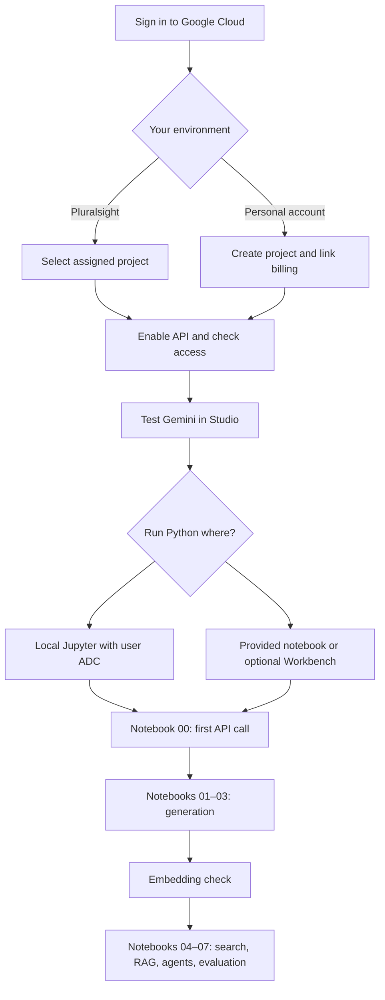

# Getting started with GCP for the AI course

This guide takes you from the Google Cloud console to running the eight notebooks in this folder. Follow the **sandbox path** if you have Pluralsight credentials. Follow the **personal-project path** only when you are using your own Google Cloud account.

Documentation checked: 21 September 2026. Google currently redirects some Vertex AI documentation to **Gemini Enterprise Agent Platform**, with **Agent Studio** and **Agent Platform Workbench** labels. Your console may still show Vertex AI, Vertex AI Studio, and Vertex AI Workbench. Use the console search bar when navigation labels differ. The existing course code uses the `vertexai=True` SDK interface. [Google platform quickstart](https://docs.cloud.google.com/vertex-ai/generative-ai/docs/start/quickstart)

This is a setup guide, not a record of a successful live sandbox run. The available files do not establish which Pluralsight sandbox product was purchased or which services your current session permits.

## 1. What you need to create

| Item | Needed for these notebooks? | Action |
|---|---|---|
| Google Cloud project | Yes | Select the assigned sandbox project, or create a personal project |
| Billing association | Yes, for the standard project setup | Sandbox provider handles this; personal-account users check their own billing |
| Vertex AI API: `aiplatform.googleapis.com` | Yes | Confirm it is enabled |
| Gemini model access | Yes | Test a prompt in Studio, then notebook 00 |
| Embedding model access | Yes, for 04–07 | Test the separate embedding model/region |
| Python/Jupyter environment | Yes | Use local Python or the supplied hosted notebook |
| Workbench instance | Optional | Create only if you want a hosted notebook and the environment permits it |
| GPU VM | No | Model inference runs through Google's APIs |
| Cloud Storage bucket | No | Course documents and images are loaded from local files or memory |
| BigQuery dataset | No | These modules do not query BigQuery |
| Vector Search index or RAG Engine corpus | No | The exercises use an in-memory NumPy index |
| Deployed model endpoint | No | The code calls publisher models |
| Agent Engine deployment | No | Notebook 06 runs the agent loop and tools in Python |
| API key or downloaded service-account key | No | This course uses Application Default Credentials (ADC) |

The resource choices above follow the code in [course_config.py](course_config.py), [lab_utils.py](lab_utils.py), and notebooks 00–07.



## 2. Sign in and select or create a project

### Path A — Pluralsight sandbox

1. Open your active sandbox session in Pluralsight. Record its expiry time, assigned Google account, and project ID.
2. Open the session's Google Cloud console link in a separate browser profile. Sign in with the supplied account.
3. In the console's top bar, click the project selector next to the Google Cloud logo. Select the assigned project; use **All** if it is absent from **Recent**.
4. Confirm both the account avatar and selected project match the sandbox information.
5. Continue to section 3. Use the existing project and billing setup; project creation is unnecessary for this path.

The old project ID in this repository is `gcp-ai-sandb-403-96741179`. Treat it as a previous session value. Use the ID displayed in your active session, even if the project name looks similar.

If no assigned project is visible, verify the account and session status. A missing **Create project** button in a restricted lab does not prevent you from using its assigned project.

### Path B — your personal Google Cloud account

1. Open the [Google Cloud console](https://console.cloud.google.com/).
2. Open **IAM & Admin → Manage resources**; choose **Create project**. The top project selector may also offer **New project**.
3. Enter a name such as `AI Course Labs`. Record the generated **project ID**, which is different from the display name and numeric project number.
4. Select the appropriate organization/folder, or **No organization** when available. Select your billing account if prompted.
5. Click **Create**, wait for completion, and select the new project in the top bar.
6. Open **Billing** and confirm that the project is linked to your intended billing account. Project creation and billing linkage require the corresponding account permissions. [Create a Google Cloud project](https://docs.cloud.google.com/resource-manager/docs/creating-managing-projects)

For your own account, open **Billing → Budgets & alerts → Create budget**. Scope it to this project, choose an amount you accept, and configure notification thresholds. An alerts-only budget sends notifications; it does not automatically stop spending. [Budget setup](https://docs.cloud.google.com/billing/docs/how-to/budgets)

**Checkpoint:** You can state the current account and project ID without looking at the values in the repository.

## 3. Enable the API and check permissions

1. Confirm the selected project again.
2. Open **APIs & Services → Library**.
3. Search for **Vertex AI API**. If the displayed name has changed, locate the API with service identifier `aiplatform.googleapis.com`.
4. Open its page and click **Enable**. If it is already enabled, you will generally see **Manage**.
5. Return to **APIs & Services → Enabled APIs & services** and confirm its presence. The standard setup also requires billing and a Python authentication method. [Platform setup](https://docs.cloud.google.com/vertex-ai/generative-ai/docs/start/quickstart)

For a sandbox, an API-enablement or IAM restriction must be resolved through the lab's supported access. Creating a second personal project does not transfer sandbox permissions or quota.

For a project you administer, use **IAM & Admin → IAM → Grant access** to assign the intended user an appropriate role. The predefined model-use role has identifier `roles/aiplatform.user`; its display name may be **Vertex AI User** or **Gemini Enterprise Agent Platform User**. Model inference requires `aiplatform.endpoints.predict`. A restricted custom role may allow inference but not saving prompts in Studio. [Model access control](https://docs.cloud.google.com/vertex-ai/generative-ai/docs/access-control)

If quota-project authentication reports missing `serviceusage.services.use`, ask the project administrator about **Service Usage Consumer** (`roles/serviceusage.serviceUsageConsumer`). Enabling APIs requires separate permissions; model-use access alone does not grant them. [Service Usage roles](https://docs.cloud.google.com/service-usage/docs/access-control)

**Checkpoint:** The API is enabled and your intended caller has model-use access. A successful console login alone does not prove either.

## 4. Make your first request in the AI portal

1. Use console search to open **Vertex AI Studio** or **Agent Studio** in the selected project.
2. Open the prompt workspace. Depending on the UI, this may appear as **Create prompt**, **Chat**, or a prompt-gallery example that opens an editor.
3. In the model settings, choose an available Gemini text model. Record its exact model ID and the location if shown.
4. Enter: `Explain the difference between a token and an embedding in three short sentences for a Python beginner.`
5. Click **Submit**, **Send**, or **Run**, as labelled in your editor.
6. Confirm that a response appears. If saving is available, save the prompt as `ai-course-first-prompt`; saving is optional.

Google's current console walkthrough starts from **Prompt Gallery**, opens a sample, selects a model in its settings panel, and submits it. The editor's available settings depend on the model. [Studio walkthrough](https://docs.cloud.google.com/vertex-ai/generative-ai/docs/start/quickstarts/quickstart)

Repeat with: `Explain tokens and embeddings in a two-column table. Include one example for each.` Compare the structure and specificity. This previews notebook 01.

If a **Get code** option is available, inspect the Python sample for the model ID and project/location. Keep the course's shared configuration for notebook execution rather than pasting a second authentication setup into every file.

**Checkpoint:** You have one successful UI response. Python credentials and the embedding model still need independent checks.

## 5. Choose where to run the notebooks

### Option A — local Windows Python, matching the existing course setup

Install Python 3.10+ and the [Google Cloud CLI](https://docs.cloud.google.com/sdk/docs/install). Reopen PowerShell after installation and check `python --version` and `gcloud --version`.

Run these commands in PowerShell. Replace `YOUR_ACTIVE_PROJECT_ID` before running:

```powershell
Set-Location 'C:\Course\DataEng\AI'
$aiProjectId = 'YOUR_ACTIVE_PROJECT_ID'
gcloud auth login
gcloud config set project $aiProjectId
gcloud auth application-default login
gcloud auth application-default set-quota-project $aiProjectId
```

Choose the intended sandbox/personal account in each browser login. CLI login and ADC login are separate: the notebooks use ADC. Browser login to the console does not authenticate a local kernel. ADC login replaces previously saved local user ADC, so check the account carefully when switching labs. [Local ADC setup](https://docs.cloud.google.com/docs/authentication/set-up-adc-local-dev-environment), [ADC login behavior](https://docs.cloud.google.com/sdk/gcloud/reference/auth/application-default/login)

Create the environment and install the course dependencies:

```powershell
python -m venv .venv
.\.venv\Scripts\python.exe -m pip install -r requirements.txt
```

Continue to section 6 before starting Jupyter. Running Python by its explicit path avoids needing to activate the environment.

### Option B — a hosted notebook already provided by the lab

Open the notebook/Jupyter link in the lab instructions. Upload the **complete AI folder**, including the helper modules and `data/handbook.json`. Preserve its directory structure.

In JupyterLab, use the file browser's upload button. You can create an `AI` folder and its `data` subfolder and upload their respective files. Keep the notebooks, `requirements.txt`, `course_config.py`, and `lab_utils.py` together.

Open a Python notebook inside `AI` and run:

```python
%pip install -r requirements.txt
```

Restart the kernel after installation. Run notebook 00's ADC check before adding another login method. A hosted notebook may use an attached service account; that identity needs access to your selected project. [ADC environment choices](https://docs.cloud.google.com/docs/authentication/provide-credentials-adc)

### Option C — create a Workbench instance when one is not provided

This is optional. Use it only in a project where instance creation is permitted and you accept the displayed cost.

1. Search the console for **Workbench** and open **Instances**.
2. Enable the **Notebooks API** if prompted. Instance management requires permissions such as `roles/notebooks.admin`; attaching a service account can require additional access.
3. Click **Create new → Advanced options**.
4. Name the instance `ai-course-notebook`. Choose an allowed region/zone, a small CPU machine, and no GPU. Enable idle shutdown, for example after 30 minutes.
5. Select the approved network and notebook access identity. Use a service account approved for model calls, or the supported user-credential option. Notebook UI access and model-call permissions are separate.
6. Review the configuration and cost, click **Create**, then **Open JupyterLab** when ready.
7. Follow Option B to upload the files and install dependencies.

If networking or identity fields require organization-specific choices, use the supplied lab configuration or local Option A. [Workbench creation and settings](https://docs.cloud.google.com/vertex-ai/docs/workbench/instances/create)

## 6. Set the course configuration

Open [course_config.py](course_config.py) in your editor or JupyterLab. The current defaults are:

| Setting | Repository default | What to use |
|---|---|---|
| `PROJECT_ID` | `gcp-ai-sandb-403-96741179` | Your active project ID |
| `LOCATION` | `global` | A supported generation location permitted by the lab |
| `EMBEDDING_LOCATION` | `us-central1` | A supported location for your embedding model |
| `MODEL_ID` | `gemini-2.5-flash` | Exact supported Gemini model ID verified for your project |
| `EMBEDDING_MODEL` | `gemini-embedding-001` | Supported embedding model compatible with the exercises |

These are existing code defaults, not a guarantee of current model availability. Check the selected model's documentation and the lab restrictions before replacing a value. Generation must support text, image input, structured output, and function calling to cover all modules. [Model versions](https://docs.cloud.google.com/vertex-ai/generative-ai/docs/learn/model-versions)

Either edit the fallback values in that file or supply environment variables. Environment variables override the file's defaults. For local Windows, in the same PowerShell session used above:

```powershell
$env:GOOGLE_CLOUD_PROJECT = $aiProjectId
$env:GOOGLE_CLOUD_LOCATION = 'global'
$env:EMBEDDING_LOCATION = 'us-central1'
# Replace the following with the exact model verified for your project.
$env:GEMINI_MODEL = 'YOUR_VERIFIED_GEMINI_MODEL_ID'
$env:EMBEDDING_MODEL = 'gemini-embedding-001'
.\.venv\Scripts\python.exe -m jupyterlab
```

Change either location if your lab requires it. These environment settings apply to this terminal and child processes. For hosted Jupyter, editing `course_config.py` is usually simpler. Restart notebook kernels after changing configuration because Python caches imported modules.

The embedding helper requests **768 dimensions**. If you change its model or dimensionality, check compatibility and rebuild all document vectors before comparing them with new query vectors.

## 7. Verify Python access before the full course

### Generation check

Open [00_setup_and_first_call.ipynb](00_setup_and_first_call.ipynb), select its Python kernel, and run cells from top to bottom using **Shift+Enter**.

Expected results:

- The first cell prints the intended project and model.
- The ADC cell prints a credential type without an authentication error.
- The final call returns a short explanation and usage metadata.

The detected ADC project may differ from the explicit course project; confirm the configured project and caller permissions rather than assuming the detected value alone determines request routing.

### Embedding check

After notebook 00 succeeds, run this in a temporary notebook cell from the same folder:

```python
from course_config import EMBEDDING_LOCATION, make_client
from lab_utils import embed_texts

embedding_client = make_client(EMBEDDING_LOCATION)
vectors = embed_texts(
    embedding_client,
    ['A data pipeline validates incoming records.'],
    'RETRIEVAL_DOCUMENT',
)
print(vectors.shape)
```

Expected shape with the existing helper: **`(1, 768)`**. This makes one live embedding request. A working Gemini generation request does not establish embedding model access.

## 8. Follow the modules: UI exploration and notebook work

The UI exercises below help you understand the portal. The Python notebooks implement the full labs; Studio does not replace their code.

| Module | What to explore in the console/UI | What to run and verify | Additional resource to create |
|---|---|---|---|
| [00 Setup](00_setup_and_first_call.ipynb) | Project selector, API page, first Studio prompt | Correct project, ADC, response and usage | None after setup |
| [01 Prompting and chat](01_gemini_prompting_and_chat.ipynb) | Compare vague/specific prompts; try a follow-up in the same chat | Prompt comparison, multi-turn context, streamed text | None |
| [02 Tokens and context](02_tokens_context_and_usage.ipynb) | Inspect token/response settings if the editor exposes them | Token counts, actual usage, input-budget loop | None; notebook counts are the exercise evidence |
| [03 Structured output and images](03_structured_output_and_multimodal.ipynb) | Ask for JSON; try the editor's image attachment control if available | Pydantic validation and interpretation of the generated chart | None; chart is created in memory |
| [04 Embeddings and search](04_embeddings_vectors_and_search.ipynb) | Find the embedding model's information through model search/Model Garden | A document-vector matrix and ranked semantic matches | None; no index deployment |
| [05 RAG](05_rag_from_scratch.ipynb) | Reuse the prompt editor to observe how supplied evidence changes answers | Local handbook chunks, retrieval, citations and an unsupported question | None; no managed RAG corpus |
| [06 Agent tools](06_agentic_ai_and_tools.ipynb) | Inspect the Gemini model's function-calling capability | Python search/arithmetic calls and a bounded agent loop | None; no hosted agent deployment |
| [07 Evaluation and capstone](07_evaluation_and_capstone.ipynb) | Use the console only to investigate access/usage issues as needed | Retrieval hit rates, answer checks, latency, usage and injection example | None; evaluation runs in Python |

Run notebook 00 first. Each later notebook initializes its own state, so run it from its first cell. Notebooks 04–07 rebuild small embedding indexes and repeat API requests when rerun. Keep [data/handbook.json](data/handbook.json) in place; it is a fictional teaching dataset.

For the module 07 learning-assistant extension, replace the handbook with your own short GCP notes while preserving document IDs and the expected JSON structure. The existing expected-answer test cases target the fictional handbook, so update them for your new content.

## 9. Find and resolve setup problems

| Symptom | Where to check | Next action |
|---|---|---|
| Assigned project missing | Account avatar, project selector, Pluralsight session | Switch to the supplied identity; confirm the session has not expired |
| API enablement blocked | APIs & Services; lab instructions | Ask the trainer/lab owner to provide permitted access |
| Studio works; Python reports missing credentials | Notebook 00; local ADC setup | Complete ADC login using the same intended account |
| 403 / permission denied | Selected project, IAM, API status, lab expiry | Check the actual Python caller; a Workbench service account may differ from your browser identity |
| Quota-project permission error | IAM/service usage access | Have the administrator check `serviceusage.services.use` |
| 404 / model not found | Model ID and model-supported locations | Correct `MODEL_ID`/location and restart the kernel |
| Generation works; embeddings fail | `EMBEDDING_MODEL` and `EMBEDDING_LOCATION` | Test embedding access separately; do not change only generation settings |
| 429 / resource exhausted | Search the console for **Quotas & System Limits**; filter the AI service | Pause and reduce calls; capacity errors may occur without a quota you can raise |
| Helper module or data file missing | Jupyter file browser/current folder | Restore the complete folder layout and launch Jupyter from `AI` |
| Package import error | Notebook kernel and requirements installation | Install with `%pip` in the hosted kernel, or use the local `.venv` Python |
| Old project still prints after editing | Environment overrides and kernel state | Correct the override, restart Jupyter if needed, then restart the kernel |
| No answer or cut-off output | Response finish reasons and usage | Inspect blocking/output-budget behavior before retrying |

If ADC uses an unexpected identity, check whether `GOOGLE_APPLICATION_CREDENTIALS` points to an old credential file. That variable takes precedence over saved local ADC; attached service-account credentials are checked later. Inspect configuration without printing credential file contents or tokens. [ADC lookup order](https://docs.cloud.google.com/docs/authentication/application-default-credentials)

For model/request diagnosis, retain the error text, timestamp, project ID, model ID, and location. The credential preflight prints only credential type and project; do not add token printing.

## 10. Save work and finish the session

For a sandbox, download changed notebooks and supporting files before expiry. Record the model IDs and locations that worked. On the next session, repeat project selection, authentication, configuration, and notebook 00; the previous project may no longer exist.

For an optional Workbench instance, save/download your work and stop the instance from the Instances page when finished. Closing the browser does not stop its VM. Delete disposable instances/disks when no longer required, after checking what will be removed; retained storage can continue to incur charges. See the [Workbench lifecycle commands](https://docs.cloud.google.com/sdk/gcloud/reference/workbench/instances) and [retained-resource billing behavior](https://docs.cloud.google.com/compute/docs/instances/deleting-instance).

In a personal project, review **Billing → Reports** with the project filter. Do not shut down a shared project as a cleanup step. If removing local sandbox credentials, `gcloud auth application-default revoke` revokes the current local user ADC; use it only when that ADC belongs to the session you are ending. [ADC cleanup](https://docs.cloud.google.com/docs/authentication/set-up-adc-local-dev-environment)

## Ready-to-start checklist

- [ ] Correct account and active project selected.
- [ ] API enabled and model access available.
- [ ] One successful Studio response.
- [ ] Complete AI folder available in the selected Python environment.
- [ ] Course configuration points to the active project and verified models.
- [ ] Notebook 00 returns a response and usage metadata.
- [ ] Embedding check returns `(1, 768)`.
- [ ] Session expiry and work-saving procedure understood.

Continue with [01 — Gemini prompting and chat](01_gemini_prompting_and_chat.ipynb).
